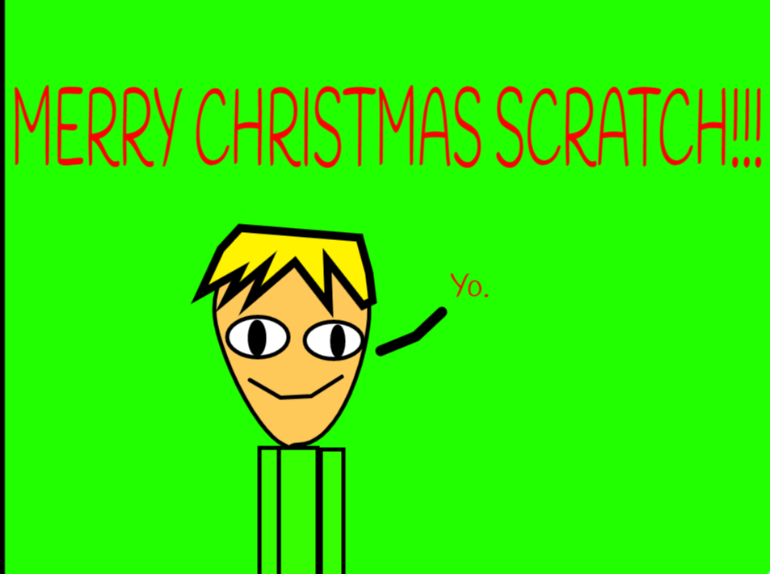

ALL MY CRAZY GAMES AND MY CRAZY MOVIES AND DRAWINGS AND SONGS!!!!!!!!!!!!!

# About me

I like coding on Scratch and playing Undertale and Deltarune. My favorite food is BURGERS!!!!!!!!!!!!!!!

# Scratch Projects

- [Devil Quest Chapter 1: a new beginning](https://scratch.mit.edu/projects/355097652/)-great start to my RPG game. it's pretty short but I didn't want to release everything in one project. Note: not mobile compatible

- [BURGER CLICKER](https://scratch.mit.edu/projects/355849341/)-I made this cuz I was bored. it's a bad game. all you do is click a burger.

- [MERRY CHRISTMAS SCRATCH!!!](https://scratch.mit.edu/projects/350113988/)-MY FIRST SCRATCH PROJECT!!! A CHEESY ANIMATION!!!!

 
 - [Devil Quest trailer](https://scratch.mit.edu/projects/356896913/)-Just a little trailer for the game DEVIL QUEST!!!!! Note: this is not just a trailer for chapter 1, it is a trailer for the whole game.
 
 

- [Pixel art creator](https://scratch.mit.edu/projects/361743998/)-I made this cuz I love pixel art and I like the Undertale simple battle creator on scratch where you can make something so easily, hit the remix button, and it's yours. SO GOOD!!!!!!

-[Devil Quest Chapter 2: Underground Chaos](https://scratch.mit.edu/projects/361009899/)- THE SEQUEL IS OUT!!!!! FIGHT TWO BOSSES AND GET THE CHAPTER 3 CODE FOR FREE!!!!!!!!!!!!!!!

# Repl.it projects

## Snek

Link to [Snek project](http://snek.batimfnafjacoob.repl.co/)

<iframe height="400px" width="100%" src="http://snek.batimfnafjacoob.repl.co/" scrolling="no" frameborder="no" allowtransparency="true" allowfullscreen="true" sandbox="allow-forms allow-pointer-lock allow-popups allow-same-origin allow-scripts allow-modals"></iframe>

# DRAWINGS

Thanks to Toby Fox for UNDERTALE and for this pixel art METTATON EX

# MUSIC

## Night knight theme

This is the theme for when you meet Night Knight in Devil Quest chapter 2. I wanted it it to sound a little bit like the song [Undyne by Toby Fox](https://tobyfox.bandcamp.com/track/undyne).

<audio controls src="Night knight theme.wav">
  Your browser doesn't support embedded audio files!
</audio>

## Night knight battle 

This is the battle music for when you fight Night Knight in Devil Quest chapter 2. I wanted it to sound like a hype version of Night Knight theme

<audio controls src="Night knight battle.wav">
  Your browser doesn't support embedded audio files!
</audio>
 
 © Jacoob 2020
